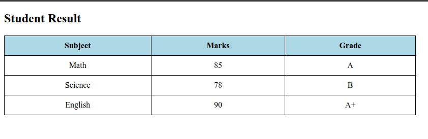
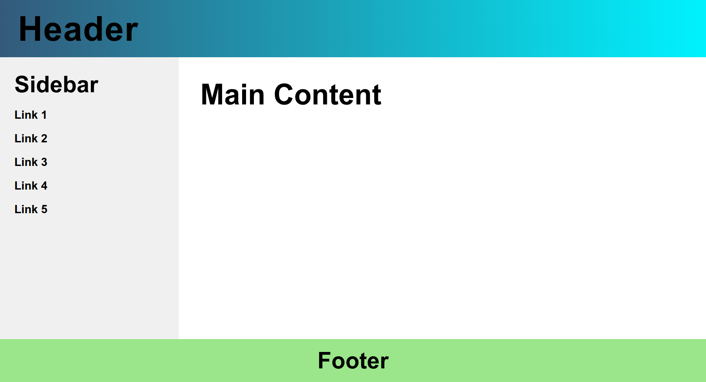
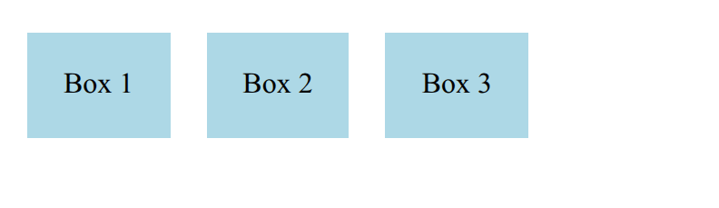
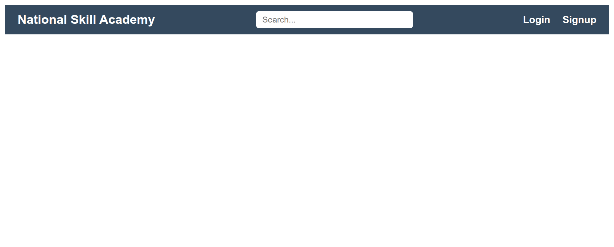
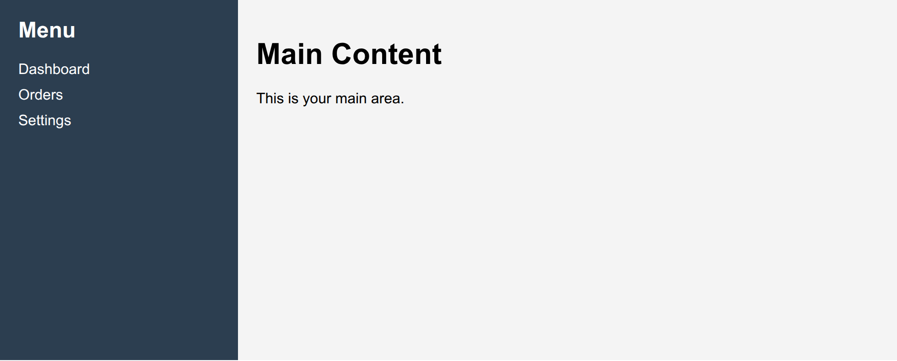
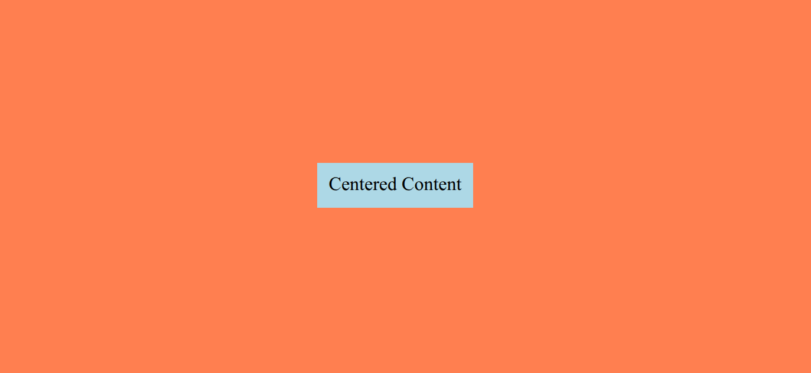

<!-- TODO: create Table of Content -->

# **Introduction to HTML**

- **HTML (HyperText Markup Language)** is the standard language used to create web pages.
- It defines the **structure and content** of a webpage.
- HTML uses **elements (called tags)** to organize content such as headings, paragraphs, links, and images.
- Tags are written inside **angle brackets** `< >`.
- Most elements have:
  - an **opening tag** (e.g., `<p>`)
  - a **closing tag** (e.g., `</p>`)

- HTML files are saved with the **.html** file extension.

---

## **HTML Elements**

- An **HTML element** consists of an **opening tag**, **content**, and a **closing tag**.
  - Example:

    ```html
    <title>Hello World</title>
    ```

- Elements can contain text or other elements.
  - Example:

    ```html
    <body>
      <p>Welcome to the world</p>
    </body>
    ```

- Elements can include **attributes** that provide additional information.
  - Example:

    ```html
    <a href="https://www.google.com">Google</a>
    ```

- Some elements are **empty (self-closing)**, meaning they do not have content or a closing tag.
  - Example:

    ```html
    <br />
    ```

- HTML tags are **not case-sensitive**, but lowercase is recommended for best practice.

---

## **Types of HTML Elements**

HTML elements are mainly divided into two types:

### 1️⃣ Block-Level Elements

- Take up the **full width** of the page
- Always start on a **new line**
- Can contain other block and inline elements

Examples:

```html
<h1>Heading</h1>
<p>This is a paragraph.</p>
<div>Container</div>
```

Common block elements:
`<div>`, `<p>`, `<h1>`–`<h6>`, `<ul>`, `<ol>`, `<section>`

---

### 2️⃣ Inline Elements

- Do **not start on a new line**
- Only take up as much width as needed
- Usually used inside block elements

Examples:

```html
<a href="#">Link</a>
<span>Text</span>
<strong>Bold Text</strong>
```

Common inline elements:
`<a>`, `<span>`, `<strong>`, `<em>`, ``

---

## **HTML Attributes**

- **Attributes** provide extra information about an HTML element.
- They are written inside the **opening tag**.
- Attributes are written in **name="value"** format.

Example:

```html
<a href="https://www.google.com">Google</a>
```

In this example:

- `href` is the attribute name
- `"https://www.google.com"` is the value

---

### Common HTML Attributes

- **class** – Used to apply CSS styles to elements
- **id** – Used to uniquely identify an element
- **style** – Used to add inline CSS styles

Example:

```html
<p id="intro" class="text" style="color:blue;">Welcome!</p>
```

---

## 📝 **Practice Activity: HTML Attributes**

### 🔹 Activity 1: Identify the Attribute

Look at the code:

```html

```

👉 Questions:

1. What is the attribute name?
2. What is the value of the attribute?
3. Is this element block or inline?

---

### 🔹 Activity 2: Fix the Code

Correct the mistake:

```html
<p id="intro">Welcome to my website</p>
```

👉 Hint: Attribute values must be inside **quotes**.

Correct Answer:

```html
<p id="intro">Welcome to my website</p>
```

---

### 🔹 Activity 3: Create Your Own

Write an `<a>` tag that:

- Links to Google
- Uses a class called `"link"`

Example Answer:

```html
<a href="https://www.google.com" class="link">Visit Google</a>
```

---

# **Text Formatting Tags in HTML**

### 🔹 Italic `<i>`

Makes text slanted.

```html
<p>This is <i>italic</i> text.</p>
```

**Output:** This is _italic_ text.

### 🔹 Bold `<b>`

Makes text bold.

```html
<p>This is <b>bold</b> text.</p>
```

**Output:** This is **bold** text.

### 🔹 Underline `<u>`

Underlines the text.

```html
<p>This is <u>underlined</u> text.</p>
```

**Output:** This is <u>underlined</u> text.

### 🔹 Superscript `<sup>`

Positions text slightly above the baseline.

```html
<p>2<sup>3</sup> = 8</p>
```

**Output:** 2³ = 8

### 🔹 Subscript `<sub>`

Positions text slightly below the baseline.

```html
<p>H<sub>2</sub>O is water</p>
```

**Output:** H₂O is water

---

---

# 🔗 **Hyperlinks in HTML**

Hyperlinks allow users to **navigate to other pages, websites, or sections within a page**. They are created using the `<a>` (anchor) tag.

---

### 🔹 Basic Link

```html
<a href="https://www.google.com">Visit Google</a>
```

- `href` = URL the link points to
- Text between `<a>` and `</a>` = **clickable text**

---

### 🔹 Open Link in a New Tab (`target` Attribute)

```html
<a href="https://www.google.com" target="_blank">Google</a>
```

- `target="_blank"` → Opens link in a **new browser tab**
- Other target options:
  - `_self` → Opens link in the **same tab** (default)
  - `_parent` → Opens link in the **parent frame**
  - `_top` → Opens link in the **full body of the window**, breaking out of frames

> **Tip:** Use `_blank` for external sites to keep users on your page

---

### 🔹 Link to Another Page on Your Site

```html
<a href="about.html">About Us</a>
```

- Links to another page within your website

---

### 🔹 Link to a Section on the Same Page (Document Fragment)

```html
<a href="#contact">Go to Contact Section</a>

<!-- Somewhere on the same page -->
<h2 id="contact">Contact Us</h2>
```

- `#contact` → Jumps to the element with `id="contact"`
- This is called a **document fragment**
- Useful for **single-page navigation** or table-of-contents links

---

```html
<!DOCTYPE html>
<html lang="en">
  <head>
    <meta charset="UTF-8" />
    <meta name="viewport" content="width=device-width, initial-scale=1.0" />
    <title>Document Fragment Long Example</title>
    <style>
      body {
        font-family: Arial, sans-serif;
        line-height: 1.6;
        margin: 20px;
      }
      nav {
        position: fixed;
        top: 0;
        left: 0;
        right: 0;
        background-color: #f8f8f8;
        padding: 15px;
        border-bottom: 1px solid #ccc;
      }
      nav a {
        margin-right: 20px;
        text-decoration: none;
        color: #0077cc;
        font-weight: bold;
      }
      nav a:hover {
        text-decoration: underline;
      }
      section {
        margin-top: 100px;
        padding: 20px;
        border: 1px solid #ccc;
        border-radius: 5px;
        min-height: 1000px; /* Make sections long for scrolling */
      }
      h2 {
        color: #333;
      }
    </style>
  </head>
  <body>
    <h1>Welcome to My Website</h1>

    <!-- Navigation Links (Document Fragments) -->
    <nav>
      <a href="#about">About Us</a>
      <a href="#services">Services</a>
      <a href="#contact">Contact</a>
    </nav>

    <!-- Sections -->
    <section id="about">
      <h2>About Us</h2>
      <p>
        Welcome to our company. We are committed to providing the best services
        possible. Our journey started many years ago, and since then, we have
        grown into a large team of dedicated professionals. Our mission is to
        provide high-quality solutions for all your needs. Lorem ipsum dolor sit
        amet, consectetur adipiscing elit. Suspendisse sit amet sapien sit amet
        urna pretium viverra. Sed vehicula, risus at porttitor efficitur, dolor
        odio tempus felis, sed fermentum elit justo at lectus. Integer posuere
        quam a fermentum aliquam. Fusce nec est at arcu cursus tincidunt.
      </p>
      <p>
        Lorem ipsum dolor sit amet, consectetur adipiscing elit. Cras at urna
        nec nulla tincidunt sodales. Etiam auctor lectus nec turpis fringilla,
        id viverra justo dignissim. Proin ut erat nec urna suscipit bibendum.
        Phasellus tincidunt, lorem vel tempus pretium, nisl erat scelerisque
        erat, nec egestas lectus nisl id felis. Mauris sed porta metus, et
        sagittis sapien. Vestibulum ante ipsum primis in faucibus orci luctus et
        ultrices posuere cubilia curae; Vestibulum sit amet quam vitae sapien
        feugiat vehicula.
      </p>
      <p>
        Curabitur eget felis nec urna fringilla imperdiet. Vivamus non bibendum
        urna. Integer gravida elit ut ex ultricies, nec fermentum lectus
        scelerisque. Cras tincidunt nisl nec tortor mattis, nec scelerisque
        lorem porta. Pellentesque habitant morbi tristique senectus et netus et
        malesuada fames ac turpis egestas.
      </p>
    </section>

    <section id="services">
      <h2>Services</h2>
      <p>
        Our services are designed to help you achieve your goals. We specialize
        in:
      </p>
      <ul>
        <li>Web Development – Building responsive, modern websites</li>
        <li>Graphic Design – Creating visually stunning designs</li>
        <li>
          SEO Optimization – Helping your website rank higher on search engines
        </li>
      </ul>
      <p>
        Lorem ipsum dolor sit amet, consectetur adipiscing elit. Curabitur eget
        felis nec urna fringilla imperdiet. Vivamus non bibendum urna. Integer
        gravida elit ut ex ultricies, nec fermentum lectus scelerisque. Cras
        tincidunt nisl nec tortor mattis, nec scelerisque lorem porta.
        Pellentesque habitant morbi tristique senectus et netus et malesuada
        fames ac turpis egestas. Lorem ipsum dolor sit amet, consectetur
        adipiscing elit. Donec ut risus vitae nulla porttitor hendrerit.
      </p>
      <p>
        Fusce in purus at nunc posuere tincidunt. Suspendisse potenti. Etiam ut
        risus non lacus blandit fringilla. Sed feugiat augue id diam
        ullamcorper, vel pulvinar arcu efficitur. Phasellus nec nisl id nisi
        ullamcorper volutpat. Donec rhoncus metus sed nisi venenatis, nec
        laoreet justo sagittis. Proin nec nisi a nulla efficitur mattis in ac
        arcu. Nullam nec erat eu nisi tincidunt luctus.
      </p>
    </section>

    <section id="contact">
      <h2>Contact</h2>
      <p>
        If you have any questions, feel free to reach out to us. We are always
        happy to help. Lorem ipsum dolor sit amet, consectetur adipiscing elit.
        Suspendisse sit amet sapien sit amet urna pretium viverra. Sed vehicula,
        risus at porttitor efficitur, dolor odio tempus felis, sed fermentum
        elit justo at lectus. Integer posuere quam a fermentum aliquam. Fusce
        nec est at arcu cursus tincidunt.
      </p>
      <p>Email: info@example.com</p>
      <p>Phone: 123-456-7890</p>
      <p>Address: 123 Main Street, City, Country</p>
      <p>
        Lorem ipsum dolor sit amet, consectetur adipiscing elit. Sed at felis ut
        urna ultrices dictum. Proin auctor turpis vel felis cursus, id fermentum
        est ultrices. Integer eu nunc id nulla luctus consectetur. Morbi euismod
        eros in lacus placerat, ac fermentum justo mattis. Vestibulum convallis
        dolor a urna tempus, a aliquet eros porttitor. Mauris vitae mi sed neque
        ullamcorper mattis.
      </p>
      <p>
        Thank you for visiting our website! We hope you find all the information
        you need and enjoy exploring our services.
      </p>
    </section>
  </body>
</html>
```

---

# 🎨 **CSS**

**CSS (Cascading Style Sheets)** is used to style HTML elements — colors, layout, spacing, fonts, animations, etc.

HTML = structure
CSS = design/style

---

## 📌 Basic CSS Syntax

```css
selector {
  property: value;
}
```

**Example**

```css
p {
  color: blue;
  font-size: 18px;
}
```

➡ This makes all `<p>` text blue and size 18px.

---

## 🎯 **Ways to Add CSS**

### 1. Inline (not recommended)

```html
<p style="color:red;">Hello</p>
```

### 2. Internal

```html
<style>
  p {
    color: red;
  }
</style>
```

### 3. External (best practice)

```html
<link rel="stylesheet" href="style.css" />
```

---

## 🎨 **Common CSS Properties**

| Property           | Description                        | Example CSS                         | Result                      |
| ------------------ | ---------------------------------- | ----------------------------------- | --------------------------- |
| `color`            | Changes text color                 | `p { color: red; }`                 | Paragraph text becomes red  |
| `background-color` | Sets background color              | `div { background-color: yellow; }` | Div background turns yellow |
| `font-size`        | Controls text size                 | `h1 { font-size: 30px; }`           | Heading text becomes larger |
| `margin`           | Space outside element              | `.box { margin: 20px; }`            | Adds outer spacing          |
| `padding`          | Space inside element               | `.box { padding: 15px; }`           | Adds inner spacing          |
| `border`           | Adds outline                       | `.box { border: 2px solid black; }` | Creates border around box   |
| `width`            | Sets element width                 | `img { width: 200px; }`             | Image width fixed           |
| `height`           | Sets element height                | `img { height: 150px; }`            | Image height fixed          |
| `text-align`       | Aligns text                        | `h1 { text-align: center; }`        | Text moves to center        |
| `display`          | Controls layout type               | `span { display: block; }`          | Inline becomes block        |
| `text-decoration`  | Adds underline, line-through, etc. | `a { text-decoration: underline; }` | Underlines text             |
| `font-weight`      | Controls boldness                  | `p { font-weight: bold; }`          | Makes text bold             |

---

## 🧱 **Selectors Basics**

| Selector | Example  | Meaning                   |
| -------- | -------- | ------------------------- |
| Element  | `p`      | all paragraphs            |
| Class    | `.box`   | elements with class="box" |
| ID       | `#title` | element with id="title"   |

Example:

```css
.box {
  background: yellow;
}
```

---

## 📦 **Box Model (Very Important Concept)**

Every element is a box:

```
Margin → Border → Padding → Content
```

You control spacing using:

```css
margin: 10px;
padding: 15px;
```

---

## 🧾 **More CSS Properties Table**

## 🟡 **Advanced Layout & Effects**

| Property     | Description               | Example                                   | Effect                     |
| ------------ | ------------------------- | ----------------------------------------- | -------------------------- |
| `position`   | Sets positioning method   | `.box { position: absolute; }`            | Allows custom placement    |
| `top`        | Distance from top         | `.box { top: 20px; }`                     | Moves element down         |
| `left`       | Distance from left        | `.box { left: 30px; }`                    | Moves element right        |
| `right`      | Distance from right       | `.box { right: 10px; }`                   | Moves element left         |
| `bottom`     | Distance from bottom      | `.box { bottom: 15px; }`                  | Moves element up           |
| `z-index`    | Controls layer order      | `.box { z-index: 10; }`                   | Brings element forward     |
| `overflow`   | Controls content overflow | `.box { overflow: hidden; }`              | Hides extra content        |
| `box-shadow` | Adds shadow               | `.box { box-shadow: 2px 2px 10px gray; }` | Adds soft shadow           |
| `transform`  | Moves/scales/rotates      | `.box { transform: rotate(20deg); }`      | Rotates element            |
| `:hover`     | Style on mouse hover      | `.btn:hover { background: red; }`         | Changes color when hovered |

---

## 🔴 **More Advanced Animation**

| Property     | Description             | Example                                             | Effect            |
| ------------ | ----------------------- | --------------------------------------------------- | ----------------- |
| `transition` | Smooth change effect    | `.box { transition: 0.3s; }`                        | Smooth animation  |
| `@keyframes` | Defines animation steps | `@keyframes move { from{left:0;} to{left:100px;} }` | Creates animation |

**Animation Example**

```css
.box {
  position: relative;
  animation: move 2s infinite;
}

@keyframes move {
  from {
    left: 0;
  }
  to {
    left: 200px;
  }
}
```

---

---

# **HTML Table**

An HTML table is used to display data in rows and columns.

## 🧱 **Basic HTML Table Example**

```html
<table border="1">
  <tr>
    <th>Name</th>
    <th>Age</th>
    <th>City</th>
  </tr>

  <tr>
    <td>Ram</td>
    <td>20</td>
    <td>Kathmandu</td>
  </tr>

  <tr>
    <td>Sita</td>
    <td>19</td>
    <td>Pokhara</td>
  </tr>
</table>
```

---

## 📊 Output

| Name | Age | City      |
| ---- | --- | --------- |
| Ram  | 20  | Kathmandu |
| Sita | 19  | Pokhara   |

---

## 📚 **Important Table Tags**

| Tag          | Use                             |
| ------------ | ------------------------------- |
| `<table>`    | Creates table                   |
| `<tr>`       | Table row                       |
| `<th>`       | Header cell (bold)              |
| `<td>`       | Data cell                       |
| `<caption>`  | Adds a title to the table       |
| `<thead>`    | Groups the header section       |
| `<tbody>`    | Groups the main body data       |
| `<tfoot>`    | Groups the footer (like totals) |
| `<colgroup>` | Groups columns for styling      |
| `<col>`      | Specifies column properties     |
| `colspan`    | Merges columns                  |
| `rowspan`    | Merges rows                     |

---

## ✨ Simple Styled Table (Beginner CSS)

```html
<style>
  table {
    border-collapse: collapse;
  }
  th,
  td {
    border: 1px solid black;
    padding: 8px;
  }
  th {
    background-color: lightblue;
  }
</style>
```

---

### ✅ **Practice Task**

Create a table that includes the following columns:

- Subject
- Marks
- Grade



---

---

# 🖼️ **Image Tag (``)**

Displays an image on a webpage.

### 📌 Syntax

```html

```

### 🧾 Example

```html

```

# 🌐 **Iframe Tag (`<iframe>`)**

Embeds another webpage, video, or map inside your page.

### 📌 Syntax

```html
<iframe src="URL"></iframe>
```

### 🧾 Example (Website)

```html
<iframe src="https://example.com" width="400" height="300"></iframe>
```

### 🧾 Example (YouTube Video)

```html
<iframe width="400" height="250" src="https://www.youtube.com/embed/VIDEO_ID">
</iframe>
```

---

### 🔑 Common iframe Attributes

| Attribute         | Meaning                  |
| ----------------- | ------------------------ |
| `src`             | Page/video link          |
| `width`           | Frame width              |
| `height`          | Frame height             |
| `title`           | Accessibility label      |
| `allowfullscreen` | Allows full screen video |

---

---

## 🏗 Mini Project: Travel Page

### **Goal:**

Create a simple travel page with images of places and an embedded map using an iframe.

---

### **HTML Code Example**

<!-- TODO: create a real one, put here an image of the website instead of code -->

```html
<!DOCTYPE html>
<html>
  <head>
    <title>My Travel Page</title>
    <style>
      body {
        font-family: Arial, sans-serif;
        text-align: center;
        background-color: #f0f8ff;
        margin: 0;
        padding: 20px;
      }
      h1,
      h2 {
        color: #2e8b57;
      }
      img {
        width: 300px;
        height: auto;
        margin: 10px;
        border: 3px solid #2e8b57;
        border-radius: 10px;
      }
      iframe {
        margin: 20px 0;
        border: 3px solid #2e8b57;
        border-radius: 10px;
      }
      .video,
      .map {
        display: block;
        margin: 0 auto;
      }
    </style>
  </head>
  <body>
    <h1>My Favorite Travel Places</h1>

    <h2>Mountains</h2>
    

    <h2>Beach</h2>
    

    <h2>Forest</h2>
    

    <h2>Waterfall</h2>
    

    <h2>Travel Video</h2>
    <iframe
      class="video"
      width="560"
      height="315"
      src="https://www.youtube.com/embed/dQw4w9WgXcQ"
      title="YouTube video"
      allowfullscreen
    ></iframe>

    <h2>Map to Kathmandu</h2>
    <iframe
      class="map"
      src="https://www.google.com/maps/embed?pb=!1m18!1m12!1m3!1d3532.5002!2d85.32396!3d27.7172!2m3!1f0!2f0!3f0!3m2!1i1024!2i768!4f13.1!3m3!1m2!1s0x39eb190d5bbf7b6f%3A0x6f5ef3f77c7a89a6!2sKathmandu%2C%20Nepal!5e0!3m2!1sen!2sus!4v1670000000000!5m2!1sen!2sus"
      width="600"
      height="450"
      allowfullscreen=""
      loading="lazy"
    ></iframe>
  </body>
</html>
```

---
---

# **Webpage Layout**

A **webpage layout** is the **arrangement of different sections on a webpage**, such as:

- **Header** – top section, usually contains the logo or title
- **Navigation** – menu or links
- **Main content** – the main area of the page
- **Sidebar** – extra info, ads, or links
- **Footer** – bottom section, copyright info

### Example:



---
---

# **Flexbox**

**Flexbox** is a powerful CSS layout system designed to help you **structure and align elements efficiently** within a container. It simplifies the process of arranging items in **rows or columns** while giving you precise control over **spacing, alignment, and order**.

---

## ✅ **Why Use Flexbox?**

- **Easy Alignment** — Center or position items horizontally and vertically with minimal code
- **Responsive Design** — Automatically adapts layouts for different screen sizes
- **Clean Spacing Control** — Distribute space evenly without complicated calculations
- **Flexible Ordering** — Rearrange elements visually without changing HTML structure

---

## **How to Use Flexbox**

1. Make a container **flexible**:

```css
.container {
  display: flex;
}
```

2. Add child elements:

```html
<div class="container">
  <div class="box">Box 1</div>
  <div class="box">Box 2</div>
  <div class="box">Box 3</div>
</div>
```

3. Add some CSS for boxes:

```css
.box {
  background-color: lightblue;
  padding: 20px;
  margin: 10px;
  text-align: center;
}
```

✅ Result:


## **Important Flexbox Properties**

### **Container Properties (applied to parent)**

| Property          | Description                               | Example                                                 |
| ----------------- | ----------------------------------------- | ------------------------------------------------------- |
| `display: flex;`  | Makes container a flex container          | `.container { display: flex; }`                         |
| `gap`             | Space between items (vertical/horizontal) | `gap: 10px;`                                            |
| `flex-direction`  | Direction of items (row/column)           | `flex-direction: row;` or `column;`                     |
| `justify-content` | Horizontal alignment of items             | `justify-content: center; space-between; space-around;` |
| `align-items`     | Vertical alignment of items               | `align-items: center; flex-start; flex-end;`            |
| `flex-wrap`       | Allow items to wrap to next line          | `flex-wrap: wrap;`                                      |

### **Item Properties (applied to child)**

| Property     | Description                   | Example                 |
| ------------ | ----------------------------- | ----------------------- |
| `flex`       | Grow/shrink space             | `flex: 1;`              |
| `align-self` | Overrides container alignment | `align-self: flex-end;` |
| `order`      | Change visual order           | `order: 2;`             |

---

## **Example with Flexbox**

### 1. Navigation (header)

```html
<style>
  body {
    font-family: Arial, sans-serif;
  }

  /* Header */
  .header {
    display: flex;
    align-items: center;
    justify-content: space-between;
    padding: 10px 20px;
    background-color: #34495e;
    color: white;
  }

  /* Logo / Brand */
  .logo {
    font-weight: bold;
    font-size: 20px;
  }

  /* Search box */
  .search-box input {
    padding: 6px 10px;
    border-radius: 4px;
    border: none;
    width: 250px;
  }

  /* Right links */
  .auth-links a {
    color: white;
    text-decoration: none;
    margin-left: 15px;
    font-weight: bold;
  }

  .auth-links a:hover {
    text-decoration: underline;
  }
</style>

<div class="header">
  <div class="logo">National Skill Academy</div>

  <div class="search-box">
    <input type="text" placeholder="Search..." />
  </div>

  <div class="auth-links">
    <a href="#">Login</a>
    <a href="#">Signup</a>
  </div>
</div>
```

**Result:**


### 2. Sidebar With Main Content

```html
<style>
  body {
    margin: 0;
    font-family: Arial, sans-serif;
  }

  .container {
    display: flex;
    min-height: 100vh;
  }

  .sidebar {
    width: 220px;
    background: #2c3e50;
    color: white;
    padding: 20px;
  }

  .sidebar h2 {
    margin-top: 0;
  }

  .sidebar a {
    display: block;
    color: white;
    text-decoration: none;
    margin: 10px 0;
  }

  .sidebar a:hover {
    text-decoration: underline;
  }

  .content {
    flex: 1;
    padding: 20px;
    background: #f4f4f4;
  }
</style>

<div class="container">
  <div class="sidebar">
    <h2>Menu</h2>
    <a href="#">Dashboard</a>
    <a href="#">Orders</a>
    <a href="#">Settings</a>
  </div>

  <div class="content">
    <h1>Main Content</h1>
    <p>This is your main area.</p>
  </div>
</div>
```

**Result:**


### 3. Centering an element

```html
<style>
  .container {
    display: flex;
    justify-content: center; /* Centers horizontally */
    align-items: center; /* Centers vertically */
    height: 100dvh;
    background-color: coral;
    padding: 20px;
  }

  .centered-content {
    background-color: lightblue;
    padding: 10px;
  }
</style>

<div class="container">
  <div class="centered-content">Centered Content</div>
</div>
```

**Result:**


---

---
